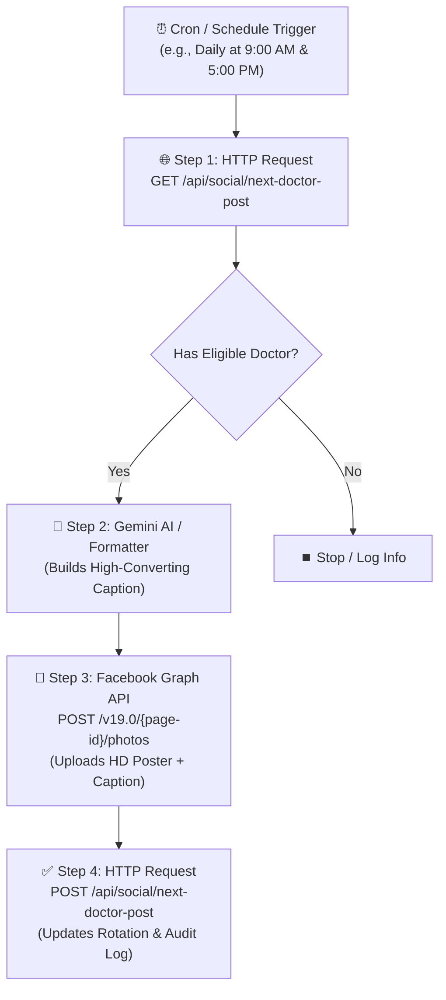

# 🤖 CD Doctors — Automated Facebook Doctor Consultation Poster Workflow (n8n Integration)

This document provides complete instructions and an **importable n8n workflow** for automatically publishing high-resolution doctor consultation posters with rich captions, chamber times, and direct serial numbers to the **CD Doctors Facebook Page** on a daily schedule.

---

## 🌟 1. System Overview & Workflow Lifecycle



---

## 🔑 2. Authentication & API Endpoints

### Master Endpoint:
`https://<YOUR_APP_DOMAIN>/api/social/next-doctor-post` (e.g., `https://cddoctors.com/api/social/next-doctor-post`)

### Headers:
```http
x-api-key: cddoctors_n8n_sec_key_2026
Content-Type: application/json
```

---

## 🛠️ 3. Detailed Step-by-Step Node Configuration in n8n

### Node 1: Schedule Trigger (শিডিউল ট্রিগার)
- **Trigger Interval**: Days / Hours
- **Example Schedule**: Every day at `09:00` (Morning) and `17:00` (Afternoon).

---

### Node 2: Fetch Next Doctor in Rotation (HTTP Request)
- **Method**: `GET`
- **URL**: `https://cddoctors.com/api/social/next-doctor-post`
- **Authentication**: None (handled via custom Header)
- **Headers**:
  - `x-api-key`: `cddoctors_n8n_sec_key_2026`
- **Output Data**:
  - `{{ $json.data.facebook_post.image_url }}`: High-res poster URL.
  - `{{ $json.data.facebook_post.caption }}`: Pre-crafted Bengali caption with doctor degrees, chamber time, phone numbers & hashtags.
  - `{{ $json.data.doctor_id }}`: Doctor unique ID.

---

### Node 3: Publish to Facebook Page (Facebook Graph API)
- **Method**: `POST`
- **URL**: `https://graph.facebook.com/v19.0/{{ $env.FACEBOOK_PAGE_ID }}/photos`
- **Query Parameters**:
  - `access_token`: `{{ $env.FACEBOOK_PAGE_ACCESS_TOKEN }}`
  - `url`: `={{ $('Fetch Next Doctor in Rotation').item.json.data.facebook_post.image_url }}`
  - `caption`: `={{ $('Fetch Next Doctor in Rotation').item.json.data.facebook_post.caption }}`

---

### Node 4: Post Official First Comment (অটোমেটিক কমেন্ট)
- **Method**: `POST`
- **URL**: `=https://graph.facebook.com/v19.0/{{ $json.id }}/comments`
- **Query Parameters**:
  - `access_token`: `{{ $env.FACEBOOK_PAGE_ACCESS_TOKEN }}`
  - `message`: `={{ $('Fetch Next Doctor in Rotation').item.json.data.facebook_post.first_comment }}`

---

### Node 5: Confirm & Update Rotation (HTTP Request Callback)
- **Method**: `POST`
- **URL**: `https://cddoctors.com/api/social/next-doctor-post`
- **Headers**:
  - `x-api-key`: `cddoctors_n8n_sec_key_2026`
  - `Content-Type`: `application/json`
- **Body Parameters (JSON)**:
  ```json
  {
    "doctorId": "={{ $('Fetch Next Doctor in Rotation').item.json.data.doctor_id }}",
    "facebookPostId": "={{ $('Publish to Facebook Page').item.json.id }}",
    "notes": "Automated daily scheduled post with first comment by n8n"
  }
  ```

---

## 📋 4. Ready-to-Import n8n Workflow JSON

You can directly copy the JSON below and paste it into your n8n workflow canvas (**Ctrl + V** inside n8n):

```json
{
  "name": "CD Doctors - Daily Facebook Doctor Poster & Auto-Comment",
  "nodes": [
    {
      "parameters": {
        "rule": {
          "interval": [
            {
              "field": "hours",
              "hoursInterval": 8
            }
          ]
        }
      },
      "id": "schedule-trigger-1",
      "name": "Daily Schedule Trigger",
      "type": "n8n-nodes-base.scheduleTrigger",
      "typeVersion": 1.2,
      "position": [
        180,
        300
      ]
    },
    {
      "parameters": {
        "url": "https://cddoctors.com/api/social/next-doctor-post",
        "sendHeaders": true,
        "headerParameters": {
          "parameters": [
            {
              "name": "x-api-key",
              "value": "cddoctors_n8n_sec_key_2026"
            }
          ]
        },
        "options": {}
      },
      "id": "http-fetch-doctor",
      "name": "Fetch Next Doctor in Rotation",
      "type": "n8n-nodes-base.httpRequest",
      "typeVersion": 4.2,
      "position": [
        400,
        300
      ]
    },
    {
      "parameters": {
        "method": "POST",
        "url": "=https://graph.facebook.com/v19.0/me/photos",
        "sendQuery": true,
        "queryParameters": {
          "parameters": [
            {
              "name": "url",
              "value": "={{ $json.data.facebook_post.image_url }}"
            },
            {
              "name": "caption",
              "value": "={{ $json.data.facebook_post.caption }}"
            },
            {
              "name": "access_token",
              "value": "={{ $env.FACEBOOK_PAGE_ACCESS_TOKEN }}"
            }
          ]
        },
        "options": {}
      },
      "id": "http-post-facebook",
      "name": "Publish to Facebook Page",
      "type": "n8n-nodes-base.httpRequest",
      "typeVersion": 4.2,
      "position": [
        620,
        300
      ]
    },
    {
      "parameters": {
        "method": "POST",
        "url": "=https://graph.facebook.com/v19.0/{{ $json.id }}/comments",
        "sendQuery": true,
        "queryParameters": {
          "parameters": [
            {
              "name": "message",
              "value": "={{ $('Fetch Next Doctor in Rotation').item.json.data.facebook_post.first_comment }}"
            },
            {
              "name": "access_token",
              "value": "={{ $env.FACEBOOK_PAGE_ACCESS_TOKEN }}"
            }
          ]
        },
        "options": {}
      },
      "id": "http-post-comment",
      "name": "Post Official Top Comment",
      "type": "n8n-nodes-base.httpRequest",
      "typeVersion": 4.2,
      "position": [
        840,
        300
      ]
    },
    {
      "parameters": {
        "method": "POST",
        "url": "https://cddoctors.com/api/social/next-doctor-post",
        "sendHeaders": true,
        "headerParameters": {
          "parameters": [
            {
              "name": "x-api-key",
              "value": "cddoctors_n8n_sec_key_2026"
            },
            {
              "name": "Content-Type",
              "value": "application/json"
            }
          ]
        },
        "sendBody": true,
        "specifyBody": "json",
        "jsonBody": "={\n  \"doctorId\": \"{{ $('Fetch Next Doctor in Rotation').item.json.data.doctor_id }}\",\n  \"facebookPostId\": \"{{ $('Publish to Facebook Page').item.json.id }}\",\n  \"notes\": \"Automated daily scheduled post with top comment by n8n\"\n}",
        "options": {}
      },
      "id": "http-log-success",
      "name": "Log Success & Update Rotation",
      "type": "n8n-nodes-base.httpRequest",
      "typeVersion": 4.2,
      "position": [
        1060,
        300
      ]
    }
  ],
  "connections": {
    "Daily Schedule Trigger": {
      "main": [
        [
          {
            "node": "Fetch Next Doctor in Rotation",
            "type": "main",
            "index": 0
          }
        ]
      ]
    },
    "Fetch Next Doctor in Rotation": {
      "main": [
        [
          {
            "node": "Publish to Facebook Page",
            "type": "main",
            "index": 0
          }
        ]
      ]
    },
    "Publish to Facebook Page": {
      "main": [
        [
          {
            "node": "Post Official Top Comment",
            "type": "main",
            "index": 0
          }
        ]
      ]
    },
    "Post Official Top Comment": {
      "main": [
        [
          {
            "node": "Log Success & Update Rotation",
            "type": "main",
            "index": 0
          }
        ]
      ]
    }
  }
}
```

---

## 🎯 5. Sample Live Facebook Post Preview

When this workflow executes, the following post will appear on your Facebook Page:

> **ডাঃ শাপলা খাতুন**  
> MBBS, BCS (Health), MS (Obs & Gynae)  
> বিশেষত্ব: স্ত্রী ও প্রসূতি রোগ বিশেষজ্ঞ ও সার্জন  
> হাসপাতাল/চেম্বার: সনো ডায়াগনস্টিক সেন্টার লিমিটেড  
> ঠিকানা: সনো টাওয়ার, হাসপাতাল রোড, চুয়াডাঙ্গা - ৭২০০  
>
> রোগী দেখার সময়: শনি, রবি, সোম, মঙ্গ, বুধ, বৃহ (বিকাল ৪:০০ থেকে রাত ৮:০০)  
>
> সিরিয়ালের জন্য সরাসরি যোগাযোগ করুন:  
> 01718-703136 | 01922-393636  
>
> 🌐 ডাক্তারের বিস্তারিত প্রোফাইল ও চেম্বার শিডিউল দেখুন:  
>     https://cddoctors.com/doctors/shapla-khatun  
>
> 📌 যেসব রোগের চিকিৎসাসেবা ও পরামর্শ প্রদান করেন:  
> ✓ নরমাল ও সিজারিয়ান ডেলিভারি  
> ✓ বন্ধ্যাত্ব ও গর্ভকালীন জটিলতা  
> ✓ জরায়ুর টিউমার, সিস্ট ও গাইনী সার্জারি  
>
> চুয়াডাঙ্গার সকল হাসপাতাল, বিশেষজ্ঞ ডাক্তার, ব্লাড ডোনার ও ২৪/৭ জরুরি অ্যাম্বুলেন্সের নির্ভরযোগ্য প্ল্যাটফর্ম — CD Doctors।  
>
> `#CDDoctors #Chuadanga #DoctorAppointment #Gynaecologist #SonoDiagnostic`
