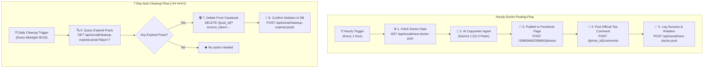

# 🤖 CD Doctors — Automated Facebook Doctor Consultation Poster Workflow (n8n Integration)

This document provides complete instructions and an **importable n8n workflow** for automatically publishing high-resolution doctor consultation posters with rich captions, chamber times, and direct serial numbers to the **CD Doctors Facebook Page** on a daily schedule, and **automatically deleting any post once it reaches 7 days of age**.

---

## 🌟 1. System Overview & Workflow Lifecycle



---

## 🔑 2. Authentication & API Endpoints

### Live Base URL:
`https://cd-doctors.vercel.app`

### Endpoints:
1. **Next Doctor Post:** `GET /api/social/next-doctor-post` & `POST /api/social/next-doctor-post`
2. **Cleanup 7-Day Expired Posts:** `GET /api/social/cleanup-expired-posts?days=7` & `POST /api/social/cleanup-expired-posts`

### Headers:
```http
x-api-key: cddoctors_n8n_sec_key_2026
Content-Type: application/json
```

---

## 📋 3. Ready-to-Import n8n Workflow JSON (Auto-Post + 7-Day Auto-Delete)

You can directly copy the JSON below and paste it into your n8n workflow canvas (**Ctrl + V** inside n8n):

```json
{
  "name": "CD Doctors - Hourly AI Agent Poster & 7-Day Auto-Delete",
  "nodes": [
    {
      "parameters": {
        "rule": {
          "interval": [
            {
              "field": "hours",
              "hoursInterval": 1
            }
          ]
        }
      },
      "id": "schedule-trigger-1",
      "name": "Hourly Schedule Trigger",
      "type": "n8n-nodes-base.scheduleTrigger",
      "typeVersion": 1.2,
      "position": [
        160,
        220
      ]
    },
    {
      "parameters": {
        "url": "https://cd-doctors.vercel.app/api/social/next-doctor-post",
        "sendHeaders": true,
        "headerParameters": {
          "parameters": [
            {
              "name": "x-api-key",
              "value": "cddoctors_n8n_sec_key_2026"
            }
          ]
        },
        "options": {}
      },
      "id": "http-fetch-doctor",
      "name": "Fetch Doctor Data",
      "type": "n8n-nodes-base.httpRequest",
      "typeVersion": 4.2,
      "position": [
        380,
        220
      ]
    },
    {
      "parameters": {
        "promptType": "define",
        "text": "=You are the Official CD Doctors Social Media Medical Marketing Copywriter AI Agent.\n\nInput Doctor Data:\n- Name: {{ $json.data.name }}\n- Degrees: {{ $json.data.degrees }}\n- Specialization: {{ $json.data.specialization }}\n- Hospital Name: {{ $json.data.hospital.name }}\n- Hospital Address: {{ $json.data.hospital.address }}\n- Chamber Schedule: {{ $json.data.schedule.schedule_summary_bn }}\n- Phone Numbers: {{ $json.data.phone }} | {{ $json.data.hospital.phone }}\n- Profile URL: {{ $json.data.social_assets.profile_url }}\n\nTask: Return the clean Bengali Facebook post caption strictly in this format without adding extra emojis:\n\n{{ $json.data.name }}\n{{ $json.data.degrees }}\nবিশেষত্ব: {{ $json.data.specialization }}\nহাসপাতাল/চেম্বার: {{ $json.data.hospital.name }}\nঠিকানা: {{ $json.data.hospital.address }}\n\nরোগী দেখার সময়: {{ $json.data.schedule.schedule_summary_bn }}\n\nসিরিয়ালের জন্য সরাসরি যোগাযোগ করুন:\n{{ $json.data.phone }} | {{ $json.data.hospital.phone }}\n\n🌐 ডাক্তারের বিস্তারিত প্রোফাইল ও চেম্বার শিডিউল দেখুন:\n    {{ $json.data.social_assets.profile_url }}\n\n📌 যেসব রোগের চিকিৎসাসেবা ও পরামর্শ প্রদান করেন:\n{{ $json.data.treated_diseases_list?.map(d => '✓ ' + d).join('\\n') || '✓ বিশেষজ্ঞ চিকিৎসা ও সার্বিক স্বাস্থ্য পরামর্শ' }}\n\nচুয়াডাঙ্গার সকল হাসপাতাল, বিশেষজ্ঞ ডাক্তার, ব্লাড ডোনার ও ২৪/৭ জরুরি অ্যাম্বুলেন্সের নির্ভরযোগ্য প্ল্যাটফর্ম — CD Doctors।\n\n#CDDoctors #Chuadanga #DoctorAppointment #HealthCare",
        "hasOutputParser": false
      },
      "id": "ai-agent-node",
      "name": "AI Doctor Copywriter Agent",
      "type": "@n8n/n8n-nodes-langchain.agent",
      "typeVersion": 1.7,
      "position": [
        600,
        220
      ]
    },
    {
      "parameters": {
        "modelName": "models/gemini-1.5-flash",
        "options": {}
      },
      "id": "gemini-chat-model",
      "name": "Google Gemini Chat Model",
      "type": "@n8n/n8n-nodes-langchain.lmChatGoogleGemini",
      "typeVersion": 1,
      "position": [
        600,
        420
      ]
    },
    {
      "parameters": {
        "method": "POST",
        "url": "https://graph.facebook.com/v19.0/108956662309663/photos",
        "sendQuery": true,
        "queryParameters": {
          "parameters": [
            {
              "name": "url",
              "value": "={{ $('Fetch Doctor Data').item.json.data.social_assets.poster_url }}"
            },
            {
              "name": "caption",
              "value": "={{ $json.output || $('Fetch Doctor Data').item.json.data.facebook_post.caption }}"
            },
            {
              "name": "access_token",
              "value": "EAAPY2hWhjyUBSdsbWon08Yw2gjnBzbG0xm8CrpsV9zy5DIulf9K5DWgbEuBZAyeqhrkb8Py15EoonPLp5YpiHBQfajqZCPXICoCRdNI9MIwvxu2Ke8WZBwak7mDlRUJJSuIbpXIWFTZCZBSKeGBZCnMHxhd46BRQb3qPXdNF7Aj9psFgQnQIZBr9GsNZCbXnotJPG9HtnS3jfK7Wyq98noZBiposvmxM0vSP23P03gZBe6wZBra"
            }
          ]
        },
        "options": {}
      },
      "id": "http-post-facebook",
      "name": "Publish to Facebook Page",
      "type": "n8n-nodes-base.httpRequest",
      "typeVersion": 4.2,
      "position": [
        840,
        220
      ]
    },
    {
      "parameters": {
        "method": "POST",
        "url": "=https://graph.facebook.com/v19.0/{{ $json.id }}/comments",
        "sendQuery": true,
        "queryParameters": {
          "parameters": [
            {
              "name": "message",
              "value": "={{ $('Fetch Doctor Data').item.json.data.facebook_post.first_comment }}"
            },
            {
              "name": "access_token",
              "value": "EAAPY2hWhjyUBSdsbWon08Yw2gjnBzbG0xm8CrpsV9zy5DIulf9K5DWgbEuBZAyeqhrkb8Py15EoonPLp5YpiHBQfajqZCPXICoCRdNI9MIwvxu2Ke8WZBwak7mDlRUJJSuIbpXIWFTZCZBSKeGBZCnMHxhd46BRQb3qPXdNF7Aj9psFgQnQIZBr9GsNZCbXnotJPG9HtnS3jfK7Wyq98noZBiposvmxM0vSP23P03gZBe6wZBra"
            }
          ]
        },
        "options": {}
      },
      "id": "http-post-comment",
      "name": "Post Official Top Comment",
      "type": "n8n-nodes-base.httpRequest",
      "typeVersion": 4.2,
      "position": [
        1060,
        220
      ]
    },
    {
      "parameters": {
        "method": "POST",
        "url": "https://cd-doctors.vercel.app/api/social/next-doctor-post",
        "sendHeaders": true,
        "headerParameters": {
          "parameters": [
            {
              "name": "x-api-key",
              "value": "cddoctors_n8n_sec_key_2026"
            },
            {
              "name": "Content-Type",
              "value": "application/json"
            }
          ]
        },
        "sendBody": true,
        "specifyBody": "json",
        "jsonBody": "={\n  \"doctorId\": \"{{ $('Fetch Doctor Data').item.json.data.doctor_id }}\",\n  \"facebookPostId\": \"{{ $('Publish to Facebook Page').item.json.id }}\",\n  \"notes\": \"Automated hourly post with 7-day retention\"\n}",
        "options": {}
      },
      "id": "http-log-success",
      "name": "Log Success & Update Rotation",
      "type": "n8n-nodes-base.httpRequest",
      "typeVersion": 4.2,
      "position": [
        1280,
        220
      ]
    },
    {
      "parameters": {
        "rule": {
          "interval": [
            {
              "field": "days",
              "daysInterval": 1
            }
          ]
        }
      },
      "id": "daily-cleanup-trigger",
      "name": "Daily 7-Day Cleanup Trigger",
      "type": "n8n-nodes-base.scheduleTrigger",
      "typeVersion": 1.2,
      "position": [
        160,
        650
      ]
    },
    {
      "parameters": {
        "url": "https://cd-doctors.vercel.app/api/social/cleanup-expired-posts?days=7",
        "sendHeaders": true,
        "headerParameters": {
          "parameters": [
            {
              "name": "x-api-key",
              "value": "cddoctors_n8n_sec_key_2026"
            }
          ]
        },
        "options": {}
      },
      "id": "http-fetch-expired",
      "name": "Fetch Posts Older than 7 Days",
      "type": "n8n-nodes-base.httpRequest",
      "typeVersion": 4.2,
      "position": [
        400,
        650
      ]
    },
    {
      "parameters": {
        "fieldToSplitOut": "posts_to_delete",
        "options": {}
      },
      "id": "split-expired-posts",
      "name": "Split Expired Posts List",
      "type": "n8n-nodes-base.itemLists",
      "typeVersion": 3,
      "position": [
        640,
        650
      ]
    },
    {
      "parameters": {
        "method": "DELETE",
        "url": "=https://graph.facebook.com/v19.0/{{ $json.facebook_post_id }}",
        "sendQuery": true,
        "queryParameters": {
          "parameters": [
            {
              "name": "access_token",
              "value": "EAAPY2hWhjyUBSdsbWon08Yw2gjnBzbG0xm8CrpsV9zy5DIulf9K5DWgbEuBZAyeqhrkb8Py15EoonPLp5YpiHBQfajqZCPXICoCRdNI9MIwvxu2Ke8WZBwak7mDlRUJJSuIbpXIWFTZCZBSKeGBZCnMHxhd46BRQb3qPXdNF7Aj9psFgQnQIZBr9GsNZCbXnotJPG9HtnS3jfK7Wyq98noZBiposvmxM0vSP23P03gZBe6wZBra"
            }
          ]
        },
        "options": {}
      },
      "id": "http-delete-facebook-post",
      "name": "Delete Post from Facebook Page",
      "type": "n8n-nodes-base.httpRequest",
      "typeVersion": 4.2,
      "position": [
        880,
        650
      ]
    },
    {
      "parameters": {
        "method": "POST",
        "url": "https://cd-doctors.vercel.app/api/social/cleanup-expired-posts",
        "sendHeaders": true,
        "headerParameters": {
          "parameters": [
            {
              "name": "x-api-key",
              "value": "cddoctors_n8n_sec_key_2026"
            },
            {
              "name": "Content-Type",
              "value": "application/json"
            }
          ]
        },
        "sendBody": true,
        "specifyBody": "json",
        "jsonBody": "={\n  \"facebookPostId\": \"{{ $('Split Expired Posts List').item.json.facebook_post_id }}\",\n  \"notes\": \"Automated cleanup of 7-day expired doctor post\"\n}",
        "options": {}
      },
      "id": "http-confirm-deletion",
      "name": "Confirm Deletion in DB",
      "type": "n8n-nodes-base.httpRequest",
      "typeVersion": 4.2,
      "position": [
        1120,
        650
      ]
    }
  ],
  "connections": {
    "Hourly Schedule Trigger": {
      "main": [
        [
          {
            "node": "Fetch Doctor Data",
            "type": "main",
            "index": 0
          }
        ]
      ]
    },
    "Fetch Doctor Data": {
      "main": [
        [
          {
            "node": "AI Doctor Copywriter Agent",
            "type": "main",
            "index": 0
          }
        ]
      ]
    },
    "Google Gemini Chat Model": {
      "ai_languageModel": [
        [
          {
            "node": "AI Doctor Copywriter Agent",
            "type": "ai_languageModel",
            "index": 0
          }
        ]
      ]
    },
    "AI Doctor Copywriter Agent": {
      "main": [
        [
          {
            "node": "Publish to Facebook Page",
            "type": "main",
            "index": 0
          }
        ]
      ]
    },
    "Publish to Facebook Page": {
      "main": [
        [
          {
            "node": "Post Official Top Comment",
            "type": "main",
            "index": 0
          }
        ]
      ]
    },
    "Post Official Top Comment": {
      "main": [
        [
          {
            "node": "Log Success & Update Rotation",
            "type": "main",
            "index": 0
          }
        ]
      ]
    },
    "Daily 7-Day Cleanup Trigger": {
      "main": [
        [
          {
            "node": "Fetch Posts Older than 7 Days",
            "type": "main",
            "index": 0
          }
        ]
      ]
    },
    "Fetch Posts Older than 7 Days": {
      "main": [
        [
          {
            "node": "Split Expired Posts List",
            "type": "main",
            "index": 0
          }
        ]
      ]
    },
    "Split Expired Posts List": {
      "main": [
        [
          {
            "node": "Delete Post from Facebook Page",
            "type": "main",
            "index": 0
          }
        ]
      ]
    },
    "Delete Post from Facebook Page": {
      "main": [
        [
          {
            "node": "Confirm Deletion in DB",
            "type": "main",
            "index": 0
          }
        ]
      ]
    }
  }
}
```

---

## 🎯 4. Sample Live Facebook Post Preview

> **ডাঃ শাপলা খাতুন**  
> MBBS, BCS (Health), MS (Obs & Gynae)  
> বিশেষত্ব: স্ত্রী ও প্রসূতি রোগ বিশেষজ্ঞ ও সার্জন  
> হাসপাতাল/চেম্বার: সনো ডায়াগনস্টিক সেন্টার লিমিটেড  
> ঠিকানা: সনো টাওয়ার, হাসপাতাল রোড, চুয়াডাঙ্গা - ৭২০০  
> 
> রোগী দেখার সময়: শনি, রবি, সোম, মঙ্গ, বুধ, বৃহ (বিকাল ৪:০০ থেকে রাত ৮:০০)  
> 
> সিরিয়ালের জন্য সরাসরি যোগাযোগ করুন:  
> 01718-703136 | 01922-393636  
> 
> 🌐 ডাক্তারের বিস্তারিত প্রোফাইল ও চেম্বার শিডিউল দেখুন:  
>     https://cddoctors.com/doctors/shapla-khatun  
> 
> 📌 যেসব রোগের চিকিৎসাসেবা ও পরামর্শ প্রদান করেন:  
> ✓ নরমাল ও সিজারিয়ান ডেলিভারি  
> ✓ বন্ধ্যাত্ব ও গর্ভকালীন জটিলতা  
> ✓ জরায়ুর টিউমার, সিস্ট ও গাইনী সার্জারি  
> 
> চুয়াডাঙ্গার সকল হাসপাতাল, বিশেষজ্ঞ ডাক্তার, ব্লাড ডোনার ও ২৪/৭ জরুরি অ্যাম্বুলেন্সের নির্ভরযোগ্য প্ল্যাটফর্ম — CD Doctors।  
> 
> `#CDDoctors #Chuadanga #DoctorAppointment #Gynaecologist #SonoDiagnostic`

---

### 💬 পিন/টপ কমেন্ট প্রিভিউ:

> চুয়াডাঙ্গাতে ২৪/৭ ডাক্তার, হাসপাতাল, রক্ত বা স্বাস্থ্যসেবা সংক্রান্ত তাৎক্ষণিক যেকোনো তথ্য সেবা পেতে আমাদের পেইজে সরাসরি মেসেজ (Inbox) করুন।  
> 
> 🌐 ওয়েবসাইট: https://cddoctors.com
